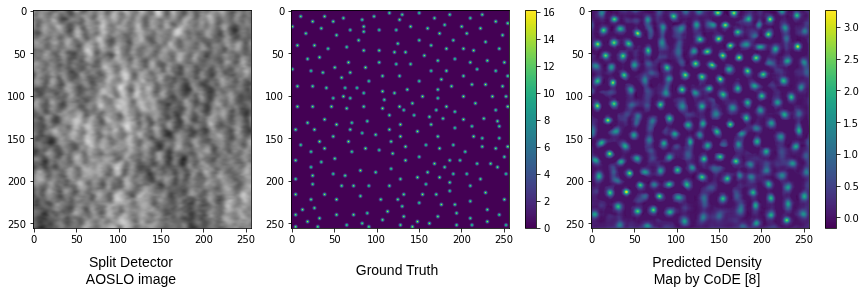
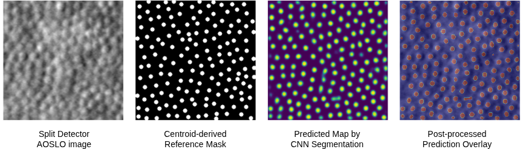

# AOSLO_Cone_Counting
Cone counting in AOSLO images


**Lightweight Deep Learning Models for Automated Retinal Cell Counting**

[](LICENSE)
[](data/README.md)
[](https://python.org)
[](https://tensorflow.org)

---

# Counting Is Not Enough: Spatially Explicit Formulations for AOSLO Cone Photoreceptor Quantification

This repository accompanies the manuscript:

**"Counting Is Not Enough: Spatially Explicit Formulations for AOSLO Cone Photoreceptor Quantification"**

The paper studies AOSLO cone photoreceptor quantification as a structured
prediction problem. Rather than proposing a new backbone architecture, it
compares different output formulations under a common experimental protocol:

- Density estimation
- Semantic segmentation
- Anchor-free object detection

The goal is to evaluate how the choice of output representation affects
counting accuracy and spatial evidence in data-limited AOSLO cone
photoreceptor quantification.

---

## Abstract

Automated cone photoreceptor quantification in adaptive optics scanning light
ophthalmoscopy (AOSLO) is often evaluated through global counting accuracy.
However, an accurate scalar count does not necessarily imply that the predicted
cone mosaic is spatially correct. We study AOSLO cone quantification as a
structured prediction problem by comparing three output formulations derived
from the same centroid-level annotations: density estimation, semantic
segmentation, and object detection. All newly implemented models are evaluated
under a common train--validation--test split and repeated independent runs.
Counting performance is assessed using mean absolute error, while mask-overlap
metrics are reported for segmentation models. The results show that the choice
of output representation affects both counting accuracy and spatial evidence,
with CNN-based semantic segmentation providing the most favorable trade-off in
the evaluated setting. These findings support evaluating AOSLO cone
quantification beyond scalar counting alone and highlight the value of
spatially explicit formulations for cellular-level retinal image analysis.

---

## Paper figures

### Density-based counting limitation

<p align="center">
  
</p>

Illustrative failure case of density-based cone counting using CoDE. From left
to right: original AOSLO image, expert-marked cone centroids, and density map
predicted by the CoDE baseline on the same image.

### CNN-based segmentation output

<p align="center">
  
</p>

Representative output of the CNN-based segmentation formulation. From left to
right: input AOSLO image, centroid-derived reference mask, predicted probability
map, and post-processed prediction overlay.

---

## Results summary

| Formulation | Model | MAE |
|------------|-------|-----|
| Density estimation | CoDE baseline | 15.35 |
| Density estimation | Model A: U-Net Density Estimation | 9.61 ± 2.01 |
| Density estimation | Model B: U-Net Density Estimation + Linear Correction | 9.87 ± 1.72 |
| Semantic segmentation | CNN Segmentation | **6.69 ± 1.76** |
| Semantic segmentation | ViT Segmentation | 9.35 ± 1.99 |
| Object detection | Anchor-free CNN Detection | 15.08 ± 2.38 |

CoDE is included as a prior reported baseline and is not retrained in this
repository.

### Segmentation metrics

| Model | Dice | IoU |
|-------|------|-----|
| CNN Segmentation | **0.495 ± 0.051** | **0.412 ± 0.041** |
| ViT Segmentation | 0.458 ± 0.045 | 0.314 ± 0.029 |

---

## Repository structure

```text
AOSLO_Cone_Counting/
├── notebooks/      # End-to-end Jupyter notebooks
├── figures/        # Figures used in the paper
├── results/        # Summary CSV files for paper tables
└── data/           # Dataset instructions only
